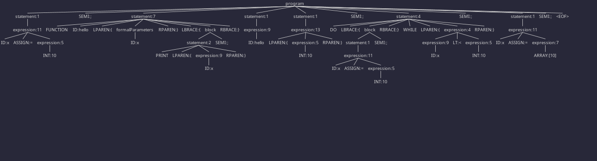

# Simple-Programming-Language

## NOTE: This project is not fully functional, and it is not completed.


## Requirements to uses this project in Linux
- Kotlin
- Jupyter Notebook
- Kotlin Kernel for Jupyter Notebook
- Python3 or Anaconda
- ANTLR v4
- IntelliJ IDEA (Optional)
- ANTLR v4 plugin for IntelliJ IDEA (Optional, but recommended if you want to add new features to the language)

## How to install Kotlin
[Kotlin Docs](https://kotlinlang.org/docs/command-line.html)

## How to install ANTLR v4.11.1
- Open a terminal
```
  cd /
  sudo curl -O https://www.antlr.org/download/antlr-4.11.1-complete.jar
  ```
## How install Kotlin Kernel for Jupyter Notebook
Check [Kotlin Kernel for Jupyter Notebook](https://github.com/Kotlin/kotlin-jupyter?tab=readme-ov-file#installation) for more details.
### Conda
```
conda install -c jetbrains kotlin-jupyter-kernel
```
### Pip
```
pip install kotlin-jupyter-kernel
```

## How to run the project
1. Run the following command in the terminal in the root of the project to build
```
make
```
2. Then in your Jupiter Notebook, or Jupiter Lab, Make sure select the Kotlin Kernel, and Restart every build you make, 
and run the cells.


## Parser Tree


Original Idea was to create a simple programming language that can be used to teach programming to beginners,
in spanish. However, the project was not completed, and the language is not fully functional. The keywords are not
translated to Spanish, for lack of time. Next steps would be to complete the language,translate keywords, and add more features to it.


## Technologies
- [![Python][python-badge]][python-url] - Python is a popular and versatile programming language known for its readability and beginner-friendliness. It's a general-purpose language used for tasks like web development, data analysis, and automation.  Think of it as a powerful tool with a clear and easy-to-learn instruction set.
- [![Kotlin][kotlin-badge]][kotlin-url] - Kotlin is a cross-platform, statically typed, general-purpose programming language with type inference. Kotlin is designed to be fully interoperable with Java, and the JVM version of its standard library depends on the Java Class Library, but type inference allows its syntax to be more concise. Kotlin mainly targets the JVM, but also compiles to JavaScript or native code (via LLVM).
- [![ANTLR][antlr-badge]][antlr-url] - ANTLR (ANother Tool for Language Recognition) is a powerful parser generator for reading, processing, executing, or translating structured text or binary files. It's widely used to build languages, tools, and frameworks. From a grammar, ANTLR generates a parser that can build and walk parse trees.
- [![Jupyter][jupyter-badge]][jupyter-url] - Jupyter Notebook is an open-source web application that allows you to create and share documents that contain live code, equations, visualizations, and narrative text. Uses include data cleaning and transformation, numerical simulation, statistical modeling, data visualization, machine learning, and much more.
- [![IntelliJ][intellij-badge]][intellij-url] - IntelliJ IDEA is an integrated development environment (IDE) written in Java for developing computer software. It is developed by JetBrains, and is available as an Apache 2 Licensed community edition, and in a proprietary commercial edition.
- [![Kotlin Kernel][kotlin-kernel-badge]][kotlin-kernel-url] - Kotlin Kernel for Jupyter Notebook is a kernel for Jupyter Notebook that lets you write Kotlin code in Jupyter Notebooks. It is based on the Jupyter Kernel protocol and lets you execute Kotlin code in Jupyter Notebooks, which is a popular tool for data analysis, data science, and machine learning.
- [![Make][make-badge]][make-url] - Make is a build automation tool that automatically builds executable programs and libraries from source code by reading files called Makefiles which specify how to derive the target program. Though integrated development environments and language-specific compiler features can also be used to manage a build process, Make remains widely used, especially in Unix and Unix-like operating systems.
- [![Git][git-badge]][git-url] - Git is a distributed version-control system for tracking changes in source code during software development. It is designed for coordinating work among programmers, but it can be used to track changes in any set of files. Its goals include speed, data integrity, and support for distributed, non-linear workflows.

[python-badge]: https://img.shields.io/badge/Python-FFD43B?style=for-the-badge&logo=python&logoColor=blue
[python-url]: https://www.python.org/
[kotlin-badge]: https://img.shields.io/badge/Kotlin-B125EA?style=for-the-badge&logo=kotlin&logoColor=white
[kotlin-url]: https://kotlinlang.org/
[antlr-badge]: https://custom-icon-badges.demolab.com/badge/ANTLR4-FFFFFF?style=for-the-badge&logo=antlr4&logoColor=blue
[antlr-url]: https://www.antlr.org/
[jupyter-badge]: https://img.shields.io/badge/Jupyter-F37626.svg?&style=for-the-badge&logo=Jupyter&logoColor=white
[jupyter-url]: https://jupyter.org/
[intellij-badge]: https://img.shields.io/badge/IntelliJ_IDEA-000000.svg?style=for-the-badge&logo=intellij-idea&logoColor=white
[intellij-url]: https://www.jetbrains.com/idea/
[kotlin-kernel-badge]: https://img.shields.io/badge/Kotlin_Kernel-FFFFFF?style=for-the-badge&logo=kotlin&logoColor=blue
[kotlin-kernel-url]: https://github.com/Kotlin/kotlin-jupyter
[make-badge]: https://img.shields.io/badge/Make-FFFFFF?style=for-the-badge&logo=make&logoColor=blue
[make-url]: https://www.gnu.org/software/make/
[git-badge]: https://img.shields.io/badge/Git-FFFFFF?style=for-the-badge&logo=git
[git-url]: https://git-scm.com/
